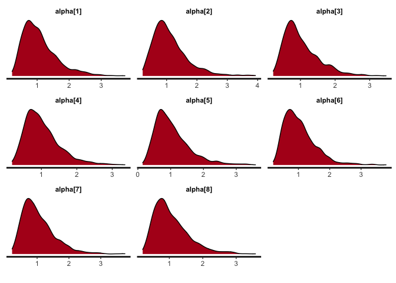

<!-- README.md is generated from README.Rmd. Please edit that file -->

# fcirt

<!-- badges: start -->

[](https://cran.r-project.org/package=fcirt)
[](https://cranlogs.r-pkg.org/badges/grand-total/fcirt "Total downloads")
<!-- badges: end -->

The goal of fcirt is to estimate forced choice models using Bayesian
method. Specifically, the Multi-Unidimensional Pairwise Preference
(MUPP) model is estimated using the R package **rstan** that utilizes
the Hamiltonian Monte Carlo sampling algorithm. Below are some important
features of the fcirt package:

1.  Item and test information calculated using either quadrature points
    or estimated person parameters can be obtained using the function
    information( ).
2.  Missing data are automatically dealt with in a way similar to how
    full information maximum likelihood handles missing data.
3.  Dimensions are allowed to correlate and the correlations are
    estimated.
4.  Statements are allowed to appear multiple times in different items
    by specifying the required pairmap argument in the function
    fcirt().  
5.  Four functions (i.e., fcirt( ), extract( ), information( ), and
    bayesplot( )) are provided for model estimation, results extraction,
    item and test information computation, and Bayesian diagnostic
    plottings, respectively.

## Installation

You can install fcirt from CRAN:

``` r
install.packages("fcirt")
```

You can install the development version of fcirt from GitHub:

``` r
devtools::install_github("Naidantu/fcirt")
```

## Example

This is a basic example which shows you how to prepare data, fit the
model, extract and plot results:

``` r
library(fcirt)

## basic example code
## Step 1: Input data
# 1.1 Response data in wide format. If the first statement is preferred, the data should be coded as 1, otherwise it should be coded as 2. 
fcirt.Data <- c(1,2,2,1,1,1,1,1,NA,1,2,1,1,2,1,1,2,2,NA,2,2,2,1,1,1,2,1,1,1,1,2,1,1,1,2,1,1,2,1,1)
fcirt.Data <- matrix(fcirt.Data,nrow = 10)
fcirt.Data
#>       [,1] [,2] [,3] [,4]
#>  [1,]    1    2    2    2
#>  [2,]    2    1    2    1
#>  [3,]    2    1    1    1
#>  [4,]    1    2    1    1
#>  [5,]    1    1    1    2
#>  [6,]    1    1    2    1
#>  [7,]    1    2    1    1
#>  [8,]    1    2    1    2
#>  [9,]   NA   NA    1    1
#> [10,]    1    2    1    1

# 1.2 A two-column data matrix: the first column is the statement number for statement s; the second column is the statement number for statement t.
pairmap <- c(1,3,5,7,2,4,6,8)
pairmap <- matrix(pairmap,ncol = 2)
pairmap
#>      [,1] [,2]
#> [1,]    1    2
#> [2,]    3    4
#> [3,]    5    6
#> [4,]    7    8

# 1.3 A column vector mapping each statement to each trait.
ind <- c(1,2,1,2,1,2,2,1)

# 1.4 A three-column matrix containing initial values for the three statement parameters (alpha, delta, tau) respectively. If using the direct MUPP estimation approach, 1 and -1 for alphas and taus are recommended and -1 or 1 for deltas are recommended depending on the signs of the statements. If using the two-step estimation approach, pre-estimated statement parameters are used as the initial values. The R package **bmggum** (Tu et al., 2021) can be used to estimate statement parameters for the two-step approach. 
ParInits <- c(1, 1, 1, 1, 1, 1, 1, 1, 1, -1, 1, 1, 1, -1, 1, 1, -1, -1, -1, -1, -1, -1, -1, -1)
ParInits <- matrix(ParInits, ncol = 3)
ParInits
#>      [,1] [,2] [,3]
#> [1,]    1    1   -1
#> [2,]    1   -1   -1
#> [3,]    1    1   -1
#> [4,]    1    1   -1
#> [5,]    1    1   -1
#> [6,]    1   -1   -1
#> [7,]    1    1   -1
#> [8,]    1    1   -1

## Step 2: Fit the MUPP model
mod <- fcirt(fcirt.Data=fcirt.Data, pairmap=pairmap, ind=ind, ParInits=ParInits, iter=1000)

## Step 3: Extract the estimated results 
# 3.1 Extract the theta estimates 
theta <- extract(x=mod, pars='theta')
# Turn the theta estimates into p*trait matrix where p equals sample size and trait equals the number of latent traits
theta <- theta[,1]
# nrow=trait
theta <- matrix(theta, nrow=2)  
theta <- t(theta)
# theta estimates in p*trait matrix format
theta
#>               [,1]         [,2]
#>  [1,]  0.043593974  0.020942930
#>  [2,] -0.052605765  0.009710104
#>  [3,] -0.038628102 -0.055032694
#>  [4,]  0.008104540  0.009413828
#>  [5,]  0.022102307 -0.028199511
#>  [6,] -0.061551491  0.017464072
#>  [7,] -0.001696831  0.011903261
#>  [8,]  0.050489759  0.023875857
#>  [9,] -0.041877383 -0.020983075
#> [10,] -0.009868542 -0.005598337
# 3.2 Extract the tau estimates
tau <- extract(x=mod, pars='tau')
tau <- tau[,1]
tau
#>     tau[1]     tau[2]     tau[3]     tau[4]     tau[5]     tau[6]     tau[7] 
#> -1.9862509 -0.9833654 -1.2623234 -1.4136347 -1.7795922 -1.0998764 -1.8196311 
#>     tau[8] 
#> -1.0626520
#3.3 Extract the estimates of the correlations among dimensions
cor <- extract(x=mod, pars='cor')

## Step 4: Plottings
# 4.1 Obtain the density plots for alpha
bayesplot(x=mod, pars='alpha', plot='density', inc_warmup=FALSE)
```



``` r
# 4.2 Obtain the trace plots for alpha
bayesplot(x=mod, pars='alpha', plot='trace', inc_warmup=FALSE)
```


``` r
## Step 5: Item information 
# 5.1 Obtain item information for item 1-3
OII <- information(x=mod, approach="direct", information="item", items=1:3)
OII
#> [1] 0.4086430 0.3964934 0.4016166
# 5.2 Obtain test information 
OTI <- information(x=mod, approach="direct", information="test")
OTI
#> [1] 1.623691
```
