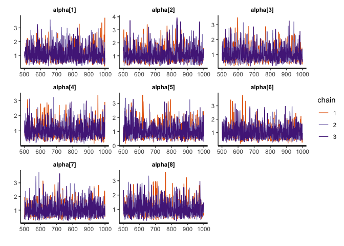

<!-- README.md is generated from README.Rmd. Please edit that file -->

# fcirt

<!-- badges: start -->

<!-- badges: end -->

The goal of fcirt is to estimate forced choice models using Bayesian
method. Specifically, the Multi-Unidimensional Pairwise Preference
(MUPP) model is estimated using the R package **rstan** that utilizes
the Hamiltonian Monte Carlo sampling algorithm. Four functions (i.e.,
fcirt( ), extract( ), information( ), and bayesplot( ) are provided for
model estimation, results extraction, item and test information
computation, and Bayesian diagnostic plottings, respectively.

## Installation

You can install the development version of fcirt from GitHub:

``` r
devtools::install_github("Naidantu/fcirt")
```

## Example

This is a basic example which shows you how to prepare data, fit the
model, extract and plot results:

``` r
library(fcirt)

## basic example code
## Step 1: Input data
# 1.1 Response data in wide format
fcirt.Data <- c(1,0,0,1,1,1,1,1,1,1,0,1,1,0,1,1,0,0,0,0,0,0,1,1,1,0,1,1,1,1,0,1,1,1,0,1,1,0,1,1)
fcirt.Data <- matrix(fcirt.Data,nrow = 10)
fcirt.Data
#>       [,1] [,2] [,3] [,4]
#>  [1,]    1    0    0    0
#>  [2,]    0    1    0    1
#>  [3,]    0    1    1    1
#>  [4,]    1    0    1    1
#>  [5,]    1    1    1    0
#>  [6,]    1    1    0    1
#>  [7,]    1    0    1    1
#>  [8,]    1    0    1    0
#>  [9,]    1    0    1    1
#> [10,]    1    0    1    1

# 1.2 A two-column data matrix: the first column is the statement number for statement s; the second column is the statement number for statement t.
pairmap <- c(1,3,5,7,2,4,6,8)
pairmap <- matrix(pairmap,ncol = 2)
pairmap
#>      [,1] [,2]
#> [1,]    1    2
#> [2,]    3    4
#> [3,]    5    6
#> [4,]    7    8

# 1.3 A column vector mapping each statement to each trait.
ind <- c(1,2,1,2,1,2,2,1)

# 1.4 A three-column matrix containing initial values for the three statement parameters (alpha, delta, tau) respectively. If using the direct MUPP estimation approach, 1 and -1 for alphas and taus are recommended and -1 or 1 for deltas are recommended depending on the signs of the statements. If using the two-step estimation approach, pre-estimated statement parameters are used as the initial values. The R package **bmggum** (Tu et al., 2021) can be used to estimate statement parameters for the two-step approach. 
ParInits <- c(1, 1, 1, 1, 1, 1, 1, 1, 1, -1, 1, 1, 1, -1, 1, 1, -1, -1, -1, -1, -1, -1, -1, -1)
ParInits <- matrix(ParInits, ncol = 3)
ParInits
#>      [,1] [,2] [,3]
#> [1,]    1    1   -1
#> [2,]    1   -1   -1
#> [3,]    1    1   -1
#> [4,]    1    1   -1
#> [5,]    1    1   -1
#> [6,]    1   -1   -1
#> [7,]    1    1   -1
#> [8,]    1    1   -1

## Step 2: Fit the MUPP model
mod <- fcirt(fcirt.Data=fcirt.Data, pairmap=pairmap, ind=ind, ParInits=ParInits, iter=1000)

## Step 3: Extract the estimated results 
# 3.1 Extract the theta estimates 
theta <- extract(x=mod, pars='theta')
# Turn the theta estimates into p*trait matrix where p equals sample size and trait equals the number of latent traits
theta <- theta[,1]
# nrow=trait
theta <- matrix(theta, nrow=2)  
theta <- t(theta)
# theta estimates in p*trait matrix format
theta
#>               [,1]         [,2]
#>  [1,]  0.007382341  0.002326966
#>  [2,]  0.061271981 -0.048335725
#>  [3,]  0.097662487 -0.080921828
#>  [4,] -0.023325852  0.055251515
#>  [5,] -0.001283002  0.038255501
#>  [6,]  0.035181477  0.001793981
#>  [7,] -0.028189537  0.054358059
#>  [8,] -0.021047059  0.025715171
#>  [9,]  0.013563438  0.051974681
#> [10,] -0.025784360  0.016004057
# 3.2 Extract the tau estimates
tau <- extract(x=mod, pars='tau')
tau <- tau[,1]
tau
#>     tau[1]     tau[2]     tau[3]     tau[4]     tau[5]     tau[6]     tau[7] 
#> -2.1121422 -0.9893592 -1.2315215 -1.5005845 -1.7751966 -1.0619002 -1.7532432 
#>     tau[8] 
#> -1.0258186

## Step 4: Plottings
# 4.1 Obtain the density plots for alpha
bayesplot(x=mod, pars='alpha', plot='density', inc_warmup=FALSE)
```


``` r
# 4.2 Obtain the trace plots for alpha
bayesplot(x=mod, pars='alpha', plot='trace', inc_warmup=FALSE)
```



``` r

## Step 5: Item information 
# 5.1 Obtain item information for item 1-3
OII <- information(x=mod, approach="direct", information="item", items=1:3)
OII
#> [1] 0.019214182 0.007737596 0.007722483
# 5.2 Obtain test information 
OTI <- information(x=mod, approach="direct", information="test")
OTI
#> [1] 0.03921591
```
